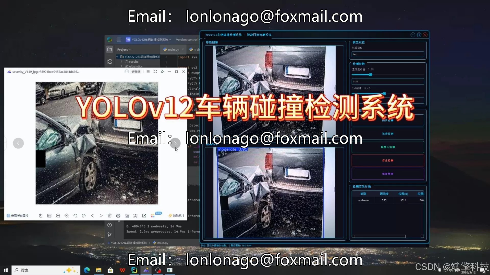
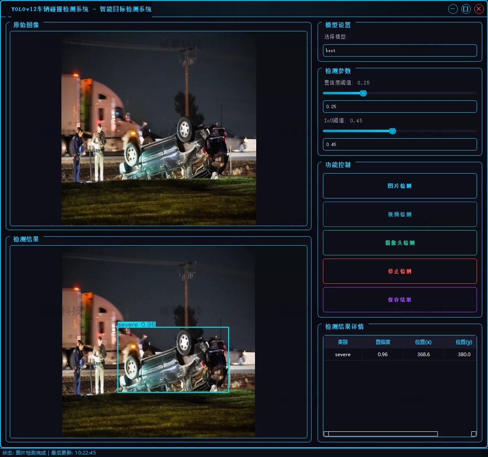
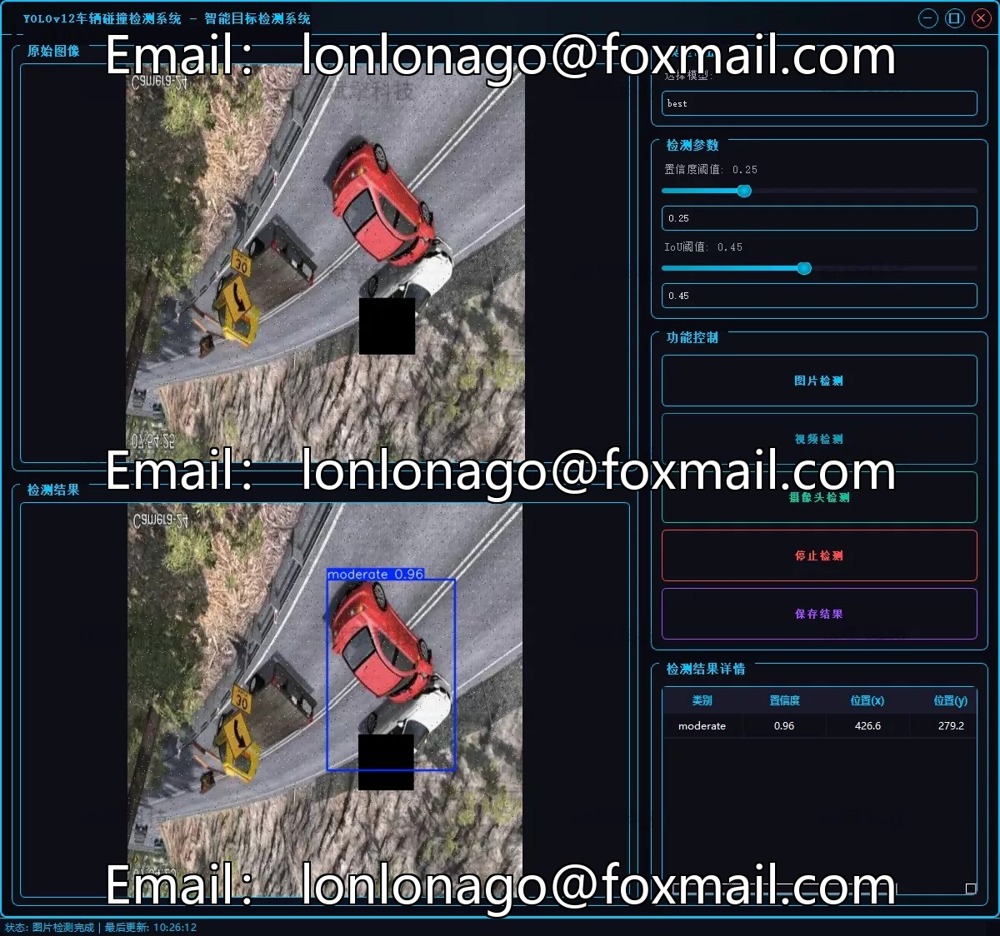
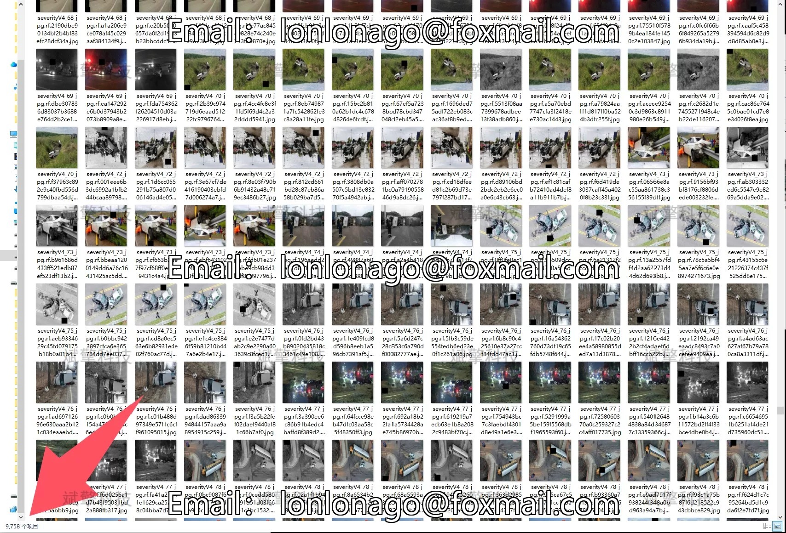
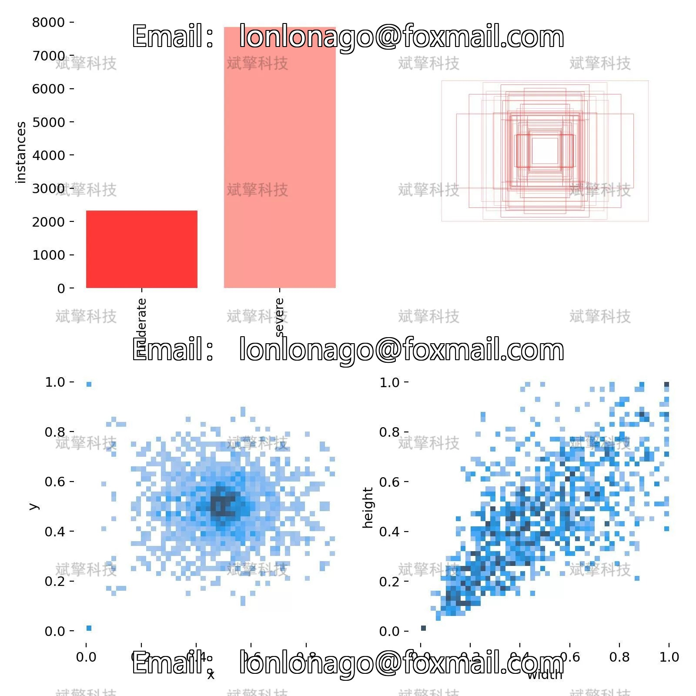
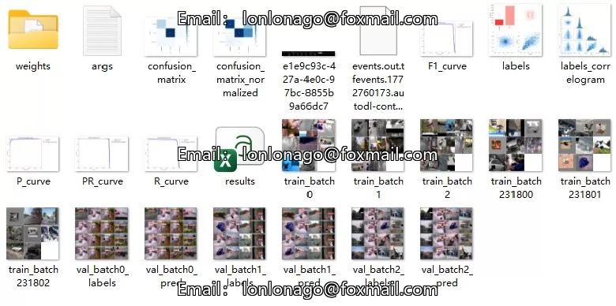
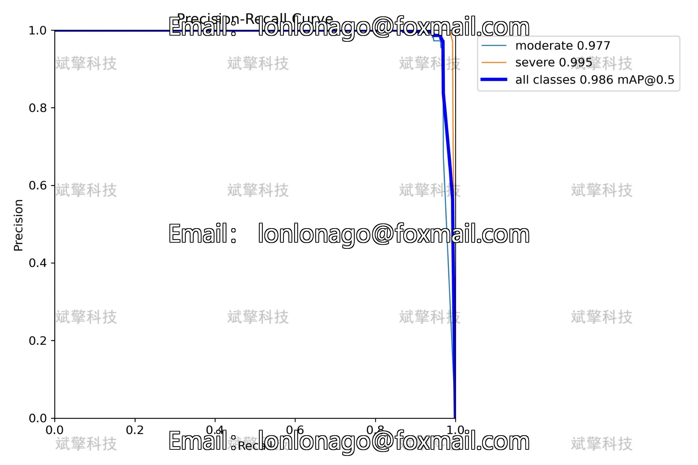
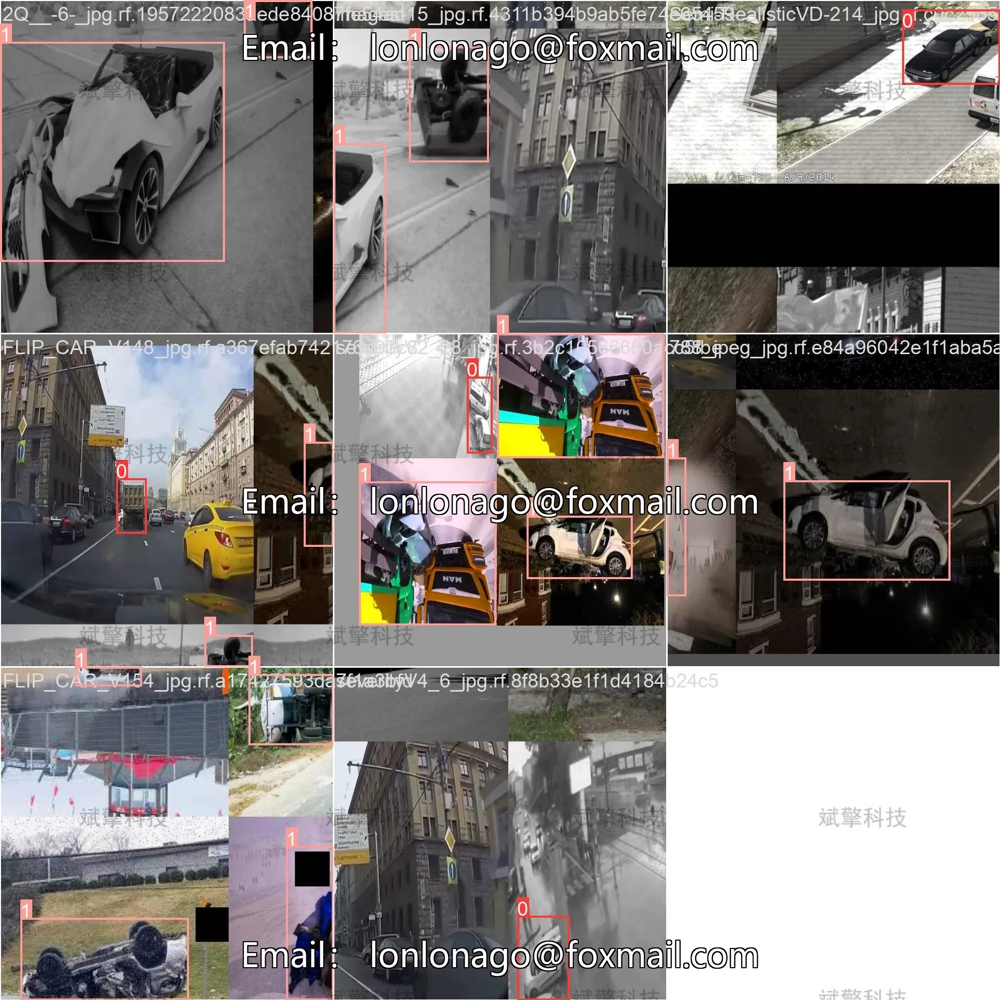
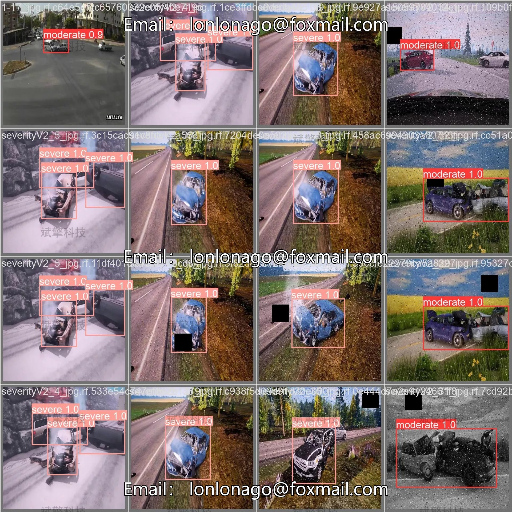

# Based on Deep Learning YOLOv12 Car Collision Detection System (YOLOv12+)

## Body

Based on the cutting-edge YOLOv12 deep learning object detection algorithm, this project aims to develop an efficient and intelligent vehicle collision detection system. This system can identify and locate vehicle collision events in real-time with high accuracy. The system is comprehensive in functionality, supporting image detection (analyzing collision damage in a single image), video detection (analyzing frames of local video files and marking the time and location of collision occurrences), and real-time camera detection (connecting road or vehicle cameras to monitor real-time scenes). Through automated and intelligent detection methods, this system aims to provide strong technical support for traffic management departments, insurance companies, and research on autonomous driving safety, enhancing the efficiency of traffic accident handling and the level of intelligence in road traffic safety.

System Function Overview
✅ User Login and Registration: Supports password verification and security validation.
✅ Three Detection Modes: Based on the YOLOv12 model, supports image, video, and real-time camera detection, accurately identifying targets.
✅ Dual-Screen Comparison: Displays original images and detection results on the same screen.
✅ Data Visualization: Real-time table displaying the category, confidence, and coordinates of detected targets.
✅ Intelligent Parameter Tuning: Offers a confidence slide bar to dynamically optimize detection accuracy, adapting to different scene requirements.
✅ Sci-Fi Style Interactive Interface: Dark theme combined with dynamic light effects, reducing visual fatigue and improving operational experience.
✅ Multi-Thread High-Performance Architecture: Independent detection threads ensure smooth operation, real-time status prompts, and rapid response without lag.
Dataset Introduction
Training Set: Total 9,758 images
Validation Set: Total 1,347 images
Test Set: Total 675 images

## Images

## Payment

Here is a pay link on Stripe ( https://buy.stripe.com/3cs8yP7sY87d0vu9AB ). Please contact me lonlonago@foxmail.com after funding $89, and I will send you a complete data files , thank you!

